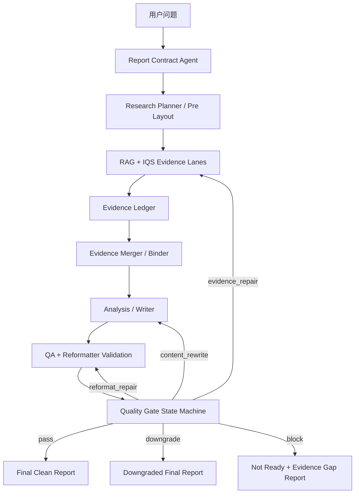

# 企业级行研分析 Agent 升级计划

本文档用于把当前项目升级为更稳定、可追溯、可评估、可人工介入的企业级行研分析 Agent。计划重点围绕三件事：

1. `report_contract`：把用户问题先变成研究任务合同。
2. `evidence_ledger`：记录证据从搜索到正文引用的完整链路。
3. `quality_gate_state_machine`：让 QA 失败后明确回到补证、重写、格式补正、降级或阻断。

本文档是实施计划，不直接改变现有流程。推荐按阶段推进，先作为旁路产物写入 `state.json` 和 `writer_package.json`，稳定后再逐步接管搜索、写作和补正闭环。

---

## 1. 当前项目结构判断

当前主流程大致为：

```text
full_report.py
  -> brain_agent.py
    -> problem_framing_agent.py / research_planner.py / pre_layout_agent.py
    -> rag_agent.py + web_analysis_agent.py + 6 路 IQS lane
    -> evidence_merger.py
    -> analysis_agent.py / evidence_binder.py / table_agent.py / claim/chapter/decision/risk agents
    -> writer_agent_clean.py
  -> qa_agent.py / review_pipeline.py
  -> reformatter_agent.py
  -> writer_package.json / state.json / clean.md
```

当前已经有很多企业级能力的雏形：

| 能力 | 当前已有位置 | 问题 |
| --- | --- | --- |
| 动态研究规划 | `problem_framing_agent.py`, `research_planner.py` | 缺少统一任务合同，规划结果没有成为全链路约束 |
| 搜索任务 | `brain_agent.py`, `dynamic_search_schema.py` | 任务目标存在，但未统一追踪完成度 |
| 证据合并 | `evidence_merger.py`, `evidence_binder.py` | 保留/丢弃/正文引用的链路不够清晰 |
| 补证循环 | `brain_agent.py` 的 followup/layout refinement | 有循环，但 QA/Reformatter 失败后的回流逻辑还不统一 |
| QA | `qa_agent.py`, `reformatter_agent.py` | 能识别问题，但没有统一决策层决定下一步 |
| 交付状态 | `writer_report.report_status`, `reformatter_result.status` | 状态分散，缺少企业级发布决策 |

结论：

不要重写整个系统。应在现有链路上增加三个控制层对象：

```text
report_contract -> evidence_ledger -> quality_gate_state_machine
```

这三个对象要成为 `state_dict` 和 `writer_package_payload` 的一等字段。

---

## 2. 目标形态

### 2.1 目标链路



### 2.2 最终交付状态

最终报告只能进入以下状态之一：

| 状态 | 含义 | 允许输出正文 |
| --- | --- | --- |
| `final` | 合同、证据、正文、格式全部通过 | 是 |
| `downgraded_final` | 证据仍有缺口，但已明确边界和降级表达 | 是 |
| `not_ready` | 关键证据缺失，不能生成正式正文 | 否，只输出缺口清单 |
| `repair_required` | 中间状态，需要继续补证/重写/格式补正 | 否，除非人工强制导出 |

---

## 3. 总体实施原则

1. 先旁路，不抢控制权。
   第一阶段只生成 `report_contract`、`evidence_ledger_summary`、`quality_gate_decision`，不改变现有报告生成结果。

2. 先结构化，再智能化。
   先用规则和已有产物拼出稳定结构，再考虑 LLM 增强。

3. 不让 Writer 决定证据是否足够。
   Writer 只渲染结构化包。是否补证、降级、阻断，由质量状态机决定。

4. 所有决策必须可追溯。
   任何 `final / downgraded_final / not_ready` 都必须能在 `writer_package.json` 中看到原因。

5. 证据不足时不硬写强结论。
   证据不足不是写作问题，而是质量门问题。

---

## 4. Phase 0：准备工作

### 4.1 目标

建立文件、命名、测试和配置约定，避免后续实现混乱。

### 4.2 新增文件

```text
rag_pipeline/agents/report_contract_schema.py
rag_pipeline/agents/report_contract_agent.py
rag_pipeline/agents/evidence_ledger.py
rag_pipeline/agents/quality_gate_state_machine.py
tests/test_report_contract_agent.py
tests/test_evidence_ledger.py
tests/test_quality_gate_state_machine.py
tests/test_enterprise_agent_integration.py
```

### 4.3 新增环境变量

建议写入 `.env`：

```env
REPORT_CONTRACT_ENABLED=true
REPORT_CONTRACT_STRICT=false

EVIDENCE_LEDGER_ENABLED=true
EVIDENCE_LEDGER_WRITE_FILE=true
EVIDENCE_LEDGER_MAX_RAW_SNIPPET_CHARS=1200

QUALITY_GATE_STATE_MACHINE_ENABLED=true
QUALITY_GATE_ENFORCE=false
QUALITY_GATE_MAX_REPAIR_ROUNDS=3
QUALITY_GATE_MIN_PASS_SCORE=75
QUALITY_GATE_ALLOW_DOWNGRADE=true
```

第一阶段 `QUALITY_GATE_ENFORCE=false`，只观察，不影响流程。

### 4.4 状态字段

在 `BrainAgentState` 增加：

```python
report_contract: Dict[str, Any]
evidence_ledger: Dict[str, Any]
evidence_ledger_summary: Dict[str, Any]
quality_gate_decision: Dict[str, Any]
quality_gate_trace: List[Dict[str, Any]]
```

在 `writer_package_payload` 增加：

```python
"report_contract": as_dict(state_dict.get("report_contract")),
"evidence_ledger_summary": as_dict(state_dict.get("evidence_ledger_summary")),
"quality_gate_decision": as_dict(state_dict.get("quality_gate_decision")),
"quality_gate_trace": as_list(state_dict.get("quality_gate_trace")),
```

如果 `EVIDENCE_LEDGER_WRITE_FILE=true`，额外写：

```text
output/full_reports/<base_name>.evidence_ledger.json
```

---

## 5. Phase 1：Report Contract

### 5.1 目标

把用户问题变成可执行、可校验、可补证的研究任务合同。它不是给用户看的正文，而是给全链路 Agent 使用的约束对象。

### 5.2 新增模块

#### `report_contract_schema.py`

职责：定义合同字段、默认规则、枚举值、校验函数。

建议包含：

```python
REPORT_TYPES = {
    "industry_deep_report",
    "company_due_diligence",
    "policy_impact_report",
    "market_entry_report",
    "competitive_analysis",
    "technology_trend_report",
}

DECISION_USES = {
    "investment_judgment",
    "strategy_decision",
    "risk_review",
    "market_tracking",
    "general_research",
}

SOURCE_LEVELS = {"A", "B", "C", "D"}

EVIDENCE_TYPES = {
    "official_policy",
    "market_size",
    "growth",
    "competition",
    "company_filing",
    "financial",
    "supply_chain",
    "customer_case",
    "technology",
    "risk",
    "counter_evidence",
}
```

#### `report_contract_agent.py`

职责：从 query、problem framing、research plan、report blueprint 中生成合同。

核心函数：

```python
def run_report_contract_agent(
    *,
    query: str,
    query_analysis: Optional[Dict[str, Any]] = None,
    research_plan: Optional[Dict[str, Any]] = None,
    report_blueprint: Optional[Dict[str, Any]] = None,
    user_options: Optional[Dict[str, Any]] = None,
) -> Dict[str, Any]:
    ...
```

内部小函数：

```python
def infer_report_type(query: str, query_analysis: Dict[str, Any]) -> str:
    ...

def infer_decision_use(query: str) -> str:
    ...

def infer_audience(query: str, decision_use: str) -> str:
    ...

def build_must_answer_questions(query: str, research_plan: Dict[str, Any]) -> List[Dict[str, Any]]:
    ...

def build_analysis_dimensions(research_plan: Dict[str, Any], report_blueprint: Dict[str, Any]) -> List[Dict[str, Any]]:
    ...

def build_mandatory_proof_requirements(report_type: str, dimensions: List[Dict[str, Any]]) -> List[Dict[str, Any]]:
    ...

def build_source_requirements(report_type: str, decision_use: str) -> Dict[str, Any]:
    ...

def build_output_requirements(report_type: str, decision_use: str) -> Dict[str, Any]:
    ...

def build_downgrade_policy(report_type: str, decision_use: str) -> Dict[str, Any]:
    ...

def validate_report_contract(contract: Dict[str, Any]) -> Dict[str, Any]:
    ...

def contract_to_search_constraints(contract: Dict[str, Any]) -> Dict[str, Any]:
    ...
```

### 5.3 合同字段设计

建议输出：

```json
{
  "agent": "report_contract_agent",
  "version": "v1",
  "contract_id": "rc_xxx",
  "query": "用户原始问题",
  "report_type": "policy_impact_report",
  "decision_use": "strategy_decision",
  "audience": "management",
  "research_object": "研究对象",
  "time_scope": {
    "start": "",
    "end": "",
    "freshness": "latest | recent | historical | mixed"
  },
  "must_answer_questions": [
    {
      "question_id": "Q1",
      "question": "必须回答的问题",
      "linked_dimension_ids": ["D1"],
      "required_answer_type": "judgment | comparison | ranking | risk | forecast_boundary"
    }
  ],
  "analysis_dimensions": [
    {
      "dimension_id": "D1",
      "name": "政策传导",
      "description": "需要判断政策如何传导到供需、成本、利润、市场准入",
      "priority": "high",
      "linked_chapter_id": "ch_01"
    }
  ],
  "mandatory_proof_requirements": [
    {
      "proof_id": "P1",
      "dimension_id": "D1",
      "claim_to_test": "政策影响是否已经传导到订单、成本或利润",
      "required_evidence_types": ["official_policy", "company_filing", "market_data"],
      "min_total_sources": 3,
      "min_ab_sources": 2,
      "requires_counter_evidence": true,
      "acceptable_source_levels": ["A", "B"],
      "freshness": "recent",
      "failure_action": "evidence_repair"
    }
  ],
  "source_requirements": {
    "min_total_sources": 12,
    "min_unique_domains": 6,
    "min_ab_sources": 6,
    "must_include_source_types": ["official", "filing", "market_research"],
    "max_d_level_ratio": 0.15
  },
  "output_requirements": {
    "min_body_chars": 16000,
    "min_body_citations": 28,
    "min_unique_cited_sources": 10,
    "must_have_sections": ["核心结论", "判断依据", "风险与反证", "行动建议"],
    "forbid_appendix_as_primary_evidence": true
  },
  "downgrade_policy": {
    "allow_downgrade": true,
    "downgrade_when": ["missing_mandatory_proof_after_repair", "low_ab_source_coverage"],
    "downgraded_status": "downgraded_final",
    "required_boundary_statement": true
  },
  "validation": {
    "passed": true,
    "errors": [],
    "warnings": []
  }
}
```

### 5.4 接入点

#### `brain_agent.py`

建议先在 `merge_outputs_node` 中生成合同，因为这时通常已经有：

- `query_analysis`
- `research_plan`
- `report_blueprint`
- `search_tasks`

第一阶段不要改变 graph，只在进入 writer 前生成：

```python
report_contract = run_report_contract_agent(
    query=query,
    query_analysis=query_analysis,
    research_plan=research_plan,
    report_blueprint=report_blueprint,
)
```

然后把它传入：

```python
writer_report["report_contract"] = report_contract
state["report_contract"] = report_contract
```

第二阶段再考虑在 graph 中增加显式节点：

```python
builder.add_node("build_report_contract", build_report_contract_node)
builder.add_edge("route", "build_report_contract")
```

### 5.5 与现有模块的关系

| 合同字段 | 数据来源 |
| --- | --- |
| `report_type` | `query_analysis.report_plan.report_type`, `report_blueprint.report_family` |
| `decision_use` | query 关键词 + `problem_framing.decision_context` |
| `analysis_dimensions` | `research_plan.chapters`, `report_blueprint.chapters` |
| `mandatory_proof_requirements` | `research_proof_registry.py`, `research_plan.evidence_goals` |
| `source_requirements` | report type 默认规则 |
| `output_requirements` | Reformatter/QA 当前阈值 + report type 默认规则 |

### 5.6 验收测试

新增 `tests/test_report_contract_agent.py`：

```python
def test_policy_impact_query_builds_policy_contract():
    ...

def test_company_due_diligence_requires_filing_and_financial_sources():
    ...

def test_contract_contains_must_answer_questions():
    ...

def test_contract_validation_blocks_empty_proof_requirements():
    ...
```

验收标准：

- 每个 query 都能生成 `contract_id`。
- `must_answer_questions` 不为空。
- `mandatory_proof_requirements` 不为空。
- 高风险用途，如投资/尽调，自动要求 A/B 来源和反证。
- 合同写入 `writer_package.json`。

---

## 6. Phase 2：Evidence Ledger

### 6.1 目标

记录每条证据从搜索任务到正文引用的全链路，解决这几个问题：

- 为什么证据少？
- 是没搜到、没抽取、被过滤、被合并丢弃，还是 Writer 没引用？
- 哪些合同要求没有被证据覆盖？
- 哪些正文引用没有对应 ledger 记录？

### 6.2 新增模块

#### `evidence_ledger.py`

核心函数：

```python
def init_evidence_ledger(*, query: str, report_contract: Dict[str, Any]) -> Dict[str, Any]:
    ...

def register_search_tasks(ledger: Dict[str, Any], tasks: Sequence[Dict[str, Any]]) -> Dict[str, Any]:
    ...

def register_raw_results(
    ledger: Dict[str, Any],
    *,
    agent_name: str,
    task: Dict[str, Any],
    results: Sequence[Dict[str, Any]],
) -> Dict[str, Any]:
    ...

def register_merged_evidence(
    ledger: Dict[str, Any],
    *,
    evidence_package: Dict[str, Any],
    chapter_evidence_packages: Sequence[Dict[str, Any]],
) -> Dict[str, Any]:
    ...

def register_rejected_evidence(
    ledger: Dict[str, Any],
    *,
    item: Dict[str, Any],
    reason: str,
) -> Dict[str, Any]:
    ...

def register_writer_citations(
    ledger: Dict[str, Any],
    *,
    markdown: str,
    source_registry: Sequence[Dict[str, Any]],
    chapter_packages: Sequence[Dict[str, Any]],
) -> Dict[str, Any]:
    ...

def summarize_evidence_ledger(
    ledger: Dict[str, Any],
    *,
    report_contract: Optional[Dict[str, Any]] = None,
) -> Dict[str, Any]:
    ...

def build_evidence_gap_report(
    *,
    report_contract: Dict[str, Any],
    ledger_summary: Dict[str, Any],
) -> Dict[str, Any]:
    ...
```

### 6.3 Ledger 数据结构

```json
{
  "agent": "evidence_ledger",
  "version": "v1",
  "ledger_id": "el_xxx",
  "query": "...",
  "contract_id": "rc_xxx",
  "search_tasks": [],
  "sources": [],
  "evidence_items": [],
  "events": [],
  "summary": {}
}
```

### 6.4 Search Task 记录

每个搜索任务记录：

```json
{
  "task_id": "ch_01_H1_support",
  "origin": "research_plan | followup | quality_gate",
  "query": "...",
  "agent": "rag | iqs | web",
  "lane_targets": ["official_data", "market_research"],
  "dimension_id": "D1",
  "chapter_id": "ch_01",
  "hypothesis_id": "H1",
  "evidence_goal_id": "P1",
  "proof_role": "support | metric | case | counter | filing",
  "required_source_levels": ["A", "B"],
  "status": "scheduled | success | partial | failed | skipped",
  "result_count": 0,
  "usable_result_count": 0
}
```

### 6.5 Evidence Item 记录

每条证据记录：

```json
{
  "evidence_id": "EVID-0001",
  "source_id": "SRC-0001",
  "origin_stage": "rag | iqs | evidence_merger | binder | writer",
  "origin_agent": "iqs_lane_1_agent",
  "search_task_id": "ch_01_H1_support",
  "query": "...",
  "url": "...",
  "title": "...",
  "publisher": "...",
  "published_date": "...",
  "domain": "...",
  "source_type": "official | filing | market_research | news | company | unknown",
  "source_level": "A | B | C | D",
  "evidence_type": "market_size | policy | financial | case | risk",
  "proof_role": "support | metric | counter | filing | source_check",
  "claim_supported": "...",
  "fact_text": "...",
  "metric": {
    "name": "",
    "value": "",
    "unit": "",
    "period": "",
    "scope": ""
  },
  "role": "core | supporting | counter | clue | rejected",
  "used_in_chapters": [],
  "used_in_claims": [],
  "citation_refs": [],
  "drop_reason": "",
  "quality_flags": []
}
```

### 6.6 Event 记录

每次关键动作记录事件：

```json
{
  "event_id": "EVT-0001",
  "event_type": "task_scheduled | raw_result_seen | evidence_retained | evidence_rejected | cited_in_report",
  "timestamp": "2026-05-18T00:00:00",
  "stage": "iqs_lane_1_agent",
  "task_id": "ch_01_H1_support",
  "evidence_id": "EVID-0001",
  "reason": "retained_as_core_evidence",
  "meta": {}
}
```

### 6.7 接入点

#### `brain_agent.py`

记录：

- 初始 `search_tasks`
- followup/layout refinement 生成的补证任务
- RAG/IQS 子 Agent 返回的 raw output 摘要

建议在这些位置挂钩：

- `build_search_tasks_for_goal`
- `run_followup_queries`
- `_run_single_followup`
- `merge_outputs_node`
- `run_writer_with_layout_refinement`

#### `evidence_merger.py`

记录：

- 证据清洗前的候选项数量
- 保留为 `core/supporting/counter/clue` 的原因
- 被 `blacklist/duplicate/low_quality/contamination/irrelevant` 丢弃的原因

新增可选参数：

```python
def merge_evidence_package(..., evidence_ledger: Optional[Dict[str, Any]] = None) -> Dict[str, Any]:
    ...
```

第一阶段也可以不改函数签名，而是在 merge 后通过现有 `evidence_package` 反推 ledger。

#### `writer_agent_clean.py`

记录：

- `source_registry`
- `chapter_packages.sections[].evidence_refs`
- 最终 `report_markdown` 中实际出现的 `[1] [2]` citation
- 未被正文引用但进入 source_registry 的来源

#### `full_report.py`

写出：

```python
writer_package_payload["evidence_ledger_summary"] = evidence_ledger_summary
```

如果启用文件输出：

```text
<base_name>.evidence_ledger.json
```

### 6.8 Summary 指标

`summarize_evidence_ledger` 输出：

```json
{
  "source_count": 0,
  "evidence_count": 0,
  "cited_source_count": 0,
  "uncited_source_count": 0,
  "ab_source_count": 0,
  "source_level_distribution": {"A": 0, "B": 0, "C": 0, "D": 0},
  "source_type_distribution": {},
  "evidence_type_distribution": {},
  "proof_role_distribution": {},
  "chapter_coverage": [],
  "proof_coverage": [],
  "dropped_evidence": [],
  "citation_coverage": {
    "inline_citation_count": 0,
    "unique_cited_sources": 0,
    "citations_without_source": [],
    "sources_without_citation": []
  },
  "contract_coverage": {
    "passed": false,
    "missing_proofs": [],
    "weak_proofs": [],
    "missing_source_types": [],
    "low_ab_source_coverage": false
  }
}
```

### 6.9 验收测试

新增 `tests/test_evidence_ledger.py`：

```python
def test_ledger_registers_search_tasks():
    ...

def test_ledger_tracks_retained_and_rejected_evidence():
    ...

def test_ledger_registers_writer_citations():
    ...

def test_ledger_summary_detects_uncited_sources():
    ...

def test_contract_coverage_detects_missing_mandatory_proof():
    ...
```

验收标准：

- `writer_package.json` 中有 `evidence_ledger_summary`。
- 每个 `search_task` 都有任务状态。
- 正文 citation 能映射到 `source_registry`。
- 能识别“证据被找到但正文没用”的情况。
- 能识别“合同要求的 proof 没被覆盖”的情况。

---

## 7. Phase 3：Quality Gate State Machine

### 7.1 目标

把 QA、Reformatter、Evidence Ledger、Report Contract 的结果统一成一个明确决策：

```text
pass
evidence_repair
content_rewrite
reformat_repair
downgrade
block
```

### 7.2 新增模块

#### `quality_gate_state_machine.py`

核心函数：

```python
def run_quality_gate_state_machine(
    *,
    report_contract: Dict[str, Any],
    qa_result: Dict[str, Any],
    package_quality_report: Dict[str, Any],
    reformatter_result: Optional[Dict[str, Any]] = None,
    reformatter_validation: Optional[Dict[str, Any]] = None,
    evidence_ledger_summary: Optional[Dict[str, Any]] = None,
    loop_state: Optional[Dict[str, Any]] = None,
) -> Dict[str, Any]:
    ...
```

内部小函数：

```python
def normalize_quality_inputs(...) -> Dict[str, Any]:
    ...

def classify_qa_errors(qa_result: Dict[str, Any]) -> Dict[str, Any]:
    ...

def classify_reformatter_failures(validation: Dict[str, Any]) -> Dict[str, Any]:
    ...

def classify_contract_gaps(contract: Dict[str, Any], ledger_summary: Dict[str, Any]) -> Dict[str, Any]:
    ...

def decide_next_action(classified: Dict[str, Any], loop_state: Dict[str, Any]) -> Dict[str, Any]:
    ...

def build_evidence_repair_tasks(...) -> List[Dict[str, Any]]:
    ...

def build_content_rewrite_tasks(...) -> List[Dict[str, Any]]:
    ...

def build_reformat_repair_tasks(...) -> List[Dict[str, Any]]:
    ...

def build_downgrade_instruction(...) -> Dict[str, Any]:
    ...
```

### 7.3 输入归一化

状态机输入来自多个地方：

| 输入 | 来源 |
| --- | --- |
| `report_contract` | 新增合同模块 |
| `qa_result` | `writer_report.qa_result` |
| `package_quality_report` | `writer_report.package_quality_report` |
| `reformatter_validation` | `validate_reformatted_report` |
| `reformatter_repair_plan` | `build_reformatter_repair_plan` |
| `evidence_ledger_summary` | 新增 ledger 模块 |
| `loop_state` | `quality_gate_trace` 或 `layout_refinement_trace` |

### 7.4 决策输出结构

```json
{
  "agent": "quality_gate_state_machine",
  "version": "v1",
  "decision": "evidence_repair",
  "publishable": false,
  "final_status": "repair_required",
  "reason_codes": [
    "missing_mandatory_proof",
    "low_unique_citation_count"
  ],
  "severity": "blocking | high | medium | low",
  "repair_tasks": [
    {
      "task_type": "evidence_repair",
      "query": "...",
      "agent": "iqs",
      "lane_targets": ["official_data", "filing_company"],
      "targets_gap": "P1",
      "proof_id": "P1",
      "priority": "high"
    }
  ],
  "rewrite_tasks": [],
  "reformat_tasks": [],
  "downgrade": {
    "allowed": true,
    "level": "",
    "required_boundary_statement": true,
    "reason": ""
  },
  "stop_reason": "",
  "loop_state": {
    "round": 0,
    "max_rounds": 3,
    "quality_score_before": 0,
    "quality_score_after": 0,
    "new_evidence_count": 0
  }
}
```

### 7.5 决策规则

#### `pass`

条件：

- `qa_result.passed == true`
- `reformatter_validation.passed == true`
- `contract_coverage.passed == true`
- `citation_coverage.unique_cited_sources >= contract.output_requirements.min_unique_cited_sources`

动作：

- `final_status = final`
- 允许写出 clean report。

#### `evidence_repair`

触发：

- `qa_result.evidence_repair_followups` 非空。
- `ledger_summary.contract_coverage.missing_proofs` 非空。
- A/B 来源数量不足。
- 核心章节没有 core/counter evidence。
- citation 数量过低且可用来源数量不足。

动作：

- 调用 `build_evidence_repair_tasks`。
- 任务回流到现有 `run_followup_queries`。

#### `content_rewrite`

触发：

- 证据覆盖达标，但 QA 报告结构、论证、章节完整性失败。
- `qa_result.content_repair_followups` 非空。
- `argument_unit_incomplete`
- `weak_chapter_judgments`
- `counter_evidence` 有证据但正文没有表达。

动作：

- 调用 writer/rewrite，不新增搜索。

#### `reformat_repair`

触发：

- 正文分析和证据覆盖达标，但 Reformatter 失败。
- `invalid_citations`
- `unexpected_sources_appendix`
- `body_table_contains_source_header`
- `repeated_boilerplate`
- 段落 citation 密度不足但 ledger 显示证据已经足够。

动作：

- 调用 Reformatter 或规则清洗。
- 不触发搜索。

#### `downgrade`

触发：

- 已达到最大补证轮数。
- followup 无新信号。
- 仍缺部分 proof，但不影响输出有限结论。
- `contract.downgrade_policy.allow_downgrade == true`

动作：

- 把报告状态改为 `downgraded_final`。
- 正文必须明确：
  - 哪些结论可确认。
  - 哪些只是观察。
  - 哪些需要后续补证。
  - 不能输出强投资建议。

#### `block`

触发：

- 关键 proof 缺失。
- 没有足够 A/B 来源。
- 无法回答 must-answer questions。
- 正文会误导用户。

动作：

- `final_status = not_ready`
- 不输出正式报告。
- 输出证据缺口清单。

### 7.6 接入点

第一阶段：在 `full_report.py` 写 `writer_package_payload` 前后运行，只记录结果：

```python
quality_gate_decision = run_quality_gate_state_machine(
    report_contract=report_contract,
    qa_result=writer_report.get("qa_result"),
    package_quality_report=writer_report.get("package_quality_report"),
    reformatter_result=reformatter_result,
    evidence_ledger_summary=evidence_ledger_summary,
)
writer_package_payload["quality_gate_decision"] = quality_gate_decision
```

第二阶段：在 Reformatter validation 后运行，用于决定是否允许 clean report 写出。

第三阶段：把 `evidence_repair` 回流给 `brain_agent.run_followup_queries`。

### 7.7 验收测试

新增 `tests/test_quality_gate_state_machine.py`：

```python
def test_gate_passes_when_contract_qa_reformatter_all_pass():
    ...

def test_gate_routes_missing_proof_to_evidence_repair():
    ...

def test_gate_routes_format_failure_to_reformat_repair():
    ...

def test_gate_routes_content_issue_to_content_rewrite():
    ...

def test_gate_downgrades_after_max_rounds_with_partial_evidence():
    ...

def test_gate_blocks_when_must_answer_question_uncovered():
    ...
```

---

## 8. Phase 4：让 Contract 约束搜索任务

### 8.1 目标

让 `report_contract` 不只是记录，而是真正影响搜索任务。

### 8.2 改造点

#### `research_planner.py`

新增可选参数：

```python
def run_research_planner_agent(
    *,
    query: str,
    llm_config: Optional[Dict[str, Any]] = None,
    report_contract: Optional[Dict[str, Any]] = None,
) -> Dict[str, Any]:
    ...
```

使用合同增强：

- `mandatory_proof_requirements` -> `evidence_goals`
- `source_requirements.must_include_source_types` -> `lane_targets`
- `requires_counter_evidence` -> counter search task
- `min_ab_sources` -> search task priority

#### `brain_agent.py`

在 `build_search_tasks_for_goal` 里加入：

```python
contract_constraints = contract_to_search_constraints(report_contract)
```

小功能：

- 如果合同要求官方来源，但 search task 没有 `official_data` lane，则补一个。
- 如果合同要求财报/公告，则补 `filing_company` lane。
- 如果合同要求反证，则每个 high priority 维度至少一个 counter task。
- 如果合同要求 `min_total_sources`，提高 `results_per_query` 和 `rerank_top_k`。

### 8.3 验收

- 政策影响类报告必须生成 official/policy/source_check 任务。
- 公司尽调类报告必须生成 filing/financial 任务。
- 投资判断类问题必须生成 counter evidence 任务。
- `search_task_schedule` 能标记哪些任务来自 contract。

---

## 9. Phase 5：让 Ledger 约束 QA

### 9.1 目标

QA 不只看正文，还要看证据账本。

### 9.2 改造点

#### `qa_agent.py`

新增参数：

```python
def run_qa_agent(
    *,
    ...
    report_contract: Optional[Dict[str, Any]] = None,
    evidence_ledger_summary: Optional[Dict[str, Any]] = None,
) -> Dict[str, Any]:
    ...
```

新增校验：

- `contract_must_answer_uncovered`
- `mandatory_proof_missing`
- `low_ab_source_coverage`
- `core_chapter_without_cited_evidence`
- `source_registry_not_cited`
- `citation_without_ledger_source`
- `too_many_d_level_sources`

### 9.3 输出增强

`qa_result` 增加：

```json
{
  "contract_quality": {
    "passed": false,
    "missing_must_answer_questions": [],
    "missing_mandatory_proofs": [],
    "source_requirement_failures": []
  },
  "ledger_quality": {
    "passed": false,
    "uncited_core_evidence": [],
    "citations_without_source": [],
    "weak_chapter_coverage": []
  }
}
```

### 9.4 验收

- 正文表面通过但缺 mandatory proof 时，QA 不通过。
- 证据被找到但正文没引用时，QA 给出 content rewrite 而不是 evidence repair。
- 来源不足时，QA 给出 evidence repair。

---

## 10. Phase 6：状态机接管补正闭环

### 10.1 目标

把现在分散在 Brain、Writer、Reformatter 中的补正判断，统一收口到 `quality_gate_state_machine`。

### 10.2 新增循环结构

建议在 `full_report.py` 增加一个独立函数：

```python
def run_enterprise_quality_loop(
    *,
    query: str,
    state_dict: Dict[str, Any],
    writer_report: Dict[str, Any],
    report_contract: Dict[str, Any],
    evidence_ledger: Dict[str, Any],
    args: argparse.Namespace,
) -> Dict[str, Any]:
    ...
```

循环伪代码：

```python
for round_index in range(max_rounds):
    ledger_summary = summarize_evidence_ledger(...)
    qa_result = writer_report.get("qa_result")
    reformatter_validation = maybe_validate_reformatter(...)

    gate = run_quality_gate_state_machine(...)
    trace.append(gate)

    if gate["decision"] == "pass":
        return final

    if gate["decision"] == "evidence_repair":
        followup_results = run_followup_queries(gate["repair_tasks"])
        rebuild_evidence_package()
        rerun_writer()
        continue

    if gate["decision"] == "content_rewrite":
        rerun_writer_or_rewrite(gate["rewrite_tasks"])
        continue

    if gate["decision"] == "reformat_repair":
        rerun_reformatter(gate["reformat_tasks"])
        continue

    if gate["decision"] == "downgrade":
        build_downgraded_report()
        return downgraded_final

    if gate["decision"] == "block":
        build_not_ready_report()
        return not_ready
```

### 10.3 回流到现有函数

不要新写搜索系统，复用：

- `brain_agent.run_followup_queries`
- `_layout_followup_queries_from_writer_report`
- `run_writer_with_layout_refinement`
- `run_reformatter`
- `validate_reformatted_report`

状态机只负责决定“调用谁”和“为什么调用”。

### 10.4 停止条件

必须实现：

- 超过 `QUALITY_GATE_MAX_REPAIR_ROUNDS`
- 本轮无新增可用证据
- 质量分无提升
- 同一 proof 连续两轮补不齐
- 用户设置 `QUALITY_GATE_ALLOW_DOWNGRADE=false` 时，不能降级，只能 `not_ready`

### 10.5 验收

- QA 报 evidence gap 时，必须生成 `evidence_repair` 任务。
- Reformatter 格式失败时，不再触发搜索。
- 多轮无新增证据时，进入 downgrade 或 block。
- `quality_gate_trace` 记录每轮 decision、reason、repair_tasks、结果。

---

## 11. Phase 7：企业级可观测性与调试输出

### 11.1 新增输出文件

每次 full report 生成：

```text
<base_name>.state.json
<base_name>.writer_package.json
<base_name>.writer.md
<base_name>_clean.md
<base_name>.evidence_ledger.json
<base_name>.quality_gate.json
```

### 11.2 `writer_package.json` 顶层字段

建议最终包含：

```json
{
  "query": "",
  "stage_status": {},
  "llm_runtime": {},
  "report_contract": {},
  "evidence_ledger_summary": {},
  "quality_gate_decision": {},
  "quality_gate_trace": [],
  "evidence_package": {},
  "structured_analysis": {},
  "report_blueprint": {},
  "chapter_evidence_packages": [],
  "table_packages": [],
  "argument_units": [],
  "chapter_packages": [],
  "writer_report": {},
  "review_result": {},
  "reformatter_result": {}
}
```

### 11.3 调试摘要

新增一个简短人类可读摘要：

```text
Contract:
- report_type: policy_impact_report
- must_answer_questions: 5
- mandatory_proofs: 18

Evidence Ledger:
- total sources: 42
- A/B sources: 19
- cited sources: 14
- missing proofs: 2

Quality Gate:
- decision: evidence_repair
- reason: missing_mandatory_proof, low_unique_citation_count
- next tasks: 4
```

可以写入：

```text
<base_name>.quality_summary.md
```

---

## 12. Phase 8：CLI 与使用方式

### 12.1 新增 CLI 参数

在 `full_report.py` 增加：

```text
--disable-report-contract
--disable-evidence-ledger
--disable-quality-gate
--quality-gate-enforce
--quality-gate-max-rounds 3
--allow-downgraded-report
--no-downgraded-report
--write-quality-summary
```

### 12.2 推荐运行模式

观察模式：

```powershell
.\start_rag.ps1 report --query "..." --disable-quality-gate
```

企业级严格模式：

```powershell
.\start_rag.ps1 report --query "..." --quality-gate-enforce --quality-gate-max-rounds 3
```

只调试证据链：

```powershell
.\start_rag.ps1 report --query "..." --write-quality-summary
```

---

## 13. 详细任务拆分

### Sprint 1：Report Contract 只读接入

任务：

1. 新增 `report_contract_schema.py`。
2. 新增 `report_contract_agent.py`。
3. 实现 `run_report_contract_agent`。
4. 在 `brain_agent.py` 中生成 `report_contract`。
5. 在 `full_report.py` 的 `writer_package_payload` 写入合同。
6. 加测试。

验收：

- 任意 full report 都能产出 `report_contract`。
- 不影响当前报告输出。
- 合同校验失败时只写 warning，不阻断。

### Sprint 2：Evidence Ledger 只读接入

任务：

1. 新增 `evidence_ledger.py`。
2. 实现 search task 注册。
3. 实现 evidence package 反推 ledger。
4. 实现 writer citation 注册。
5. 实现 ledger summary。
6. 写入 `writer_package` 和独立 ledger 文件。
7. 加测试。

验收：

- 能看到 search task -> evidence -> citation 的链路。
- 能识别未引用来源。
- 能识别缺失 proof。

### Sprint 3：Quality Gate 只读决策

任务：

1. 新增 `quality_gate_state_machine.py`。
2. 实现错误分类。
3. 实现 decision 规则。
4. 在 `full_report.py` 生成 `quality_gate_decision`。
5. 写入 `writer_package`。
6. 加测试。

验收：

- QA 失败能被归类到 evidence/content/format。
- 不改变现有报告输出。
- 每次都有可解释 decision。

### Sprint 4：Contract 约束 Planner/Search

任务：

1. `research_planner` 接收 contract。
2. `build_search_tasks_for_goal` 读取 proof requirements。
3. 高风险报告自动生成 counter/source_check/filing tasks。
4. `search_task_schedule` 标记 `origin=contract`。
5. 加测试。

验收：

- 公司尽调必有 filing 任务。
- 政策影响必有 official policy/source_check 任务。
- 投资判断必有 counter evidence 任务。

### Sprint 5：Ledger 约束 QA

任务：

1. `qa_agent` 接收 `report_contract` 和 `evidence_ledger_summary`。
2. 增加 contract/ledger quality checks。
3. QA followups 带上 `proof_id` 和 `evidence_goal_id`。
4. 加测试。

验收：

- 正文看似完整但缺关键 proof 时不能 passed。
- 证据足够但正文没引用时路由到 content rewrite。
- 证据不足时路由到 evidence repair。

### Sprint 6：状态机接管补正

任务：

1. 在 `full_report.py` 增加 `run_enterprise_quality_loop`。
2. `evidence_repair` 调用 `run_followup_queries`。
3. `content_rewrite` 调用 writer/rewrite。
4. `reformat_repair` 调用 reformatter。
5. `downgrade/block` 输出稳定状态。
6. 加端到端测试。

验收：

- 补正路径清晰。
- 每轮有 trace。
- 不会无限循环。
- 无证据时不会硬输出 final。

---

## 14. 回归测试矩阵

建议维护 `golden_cases`：

| Case | Query 类型 | 必测点 |
| --- | --- | --- |
| `policy_us_china_multisector` | 政策影响 | official/source_check/counter evidence |
| `company_due_diligence` | 公司尽调 | filing/financial/risk |
| `industry_robotics` | 行业深度 | market size/growth/competition/case |
| `market_entry_consumer` | 市场进入 | demand/channel/competition/regulation |
| `technology_trend_ai_material` | 技术趋势 | technology/product/patent/case |

每个 case 记录：

```json
{
  "query": "...",
  "expected_report_type": "...",
  "must_have_contract_fields": [],
  "minimum_sources": 10,
  "minimum_ab_sources": 5,
  "must_have_evidence_types": [],
  "must_have_quality_gate_decision": "pass | downgraded_final | not_ready",
  "forbidden_final_status_when_missing_proof": "final"
}
```

---

## 15. 风险与回滚

### 15.1 主要风险

| 风险 | 表现 | 处理 |
| --- | --- | --- |
| 合同过严 | 报告经常 not_ready | 第一阶段只 warning，逐步调阈值 |
| Ledger 记录太大 | writer_package 变得很重 | raw snippet 限长，完整 ledger 单独文件 |
| 状态机误判 | 本该重写却去补证 | 保留 trace，先不 enforce |
| 补证循环过慢 | 运行时间过长 | 限制 max rounds 和 max followups |
| 降级报告滥用 | 把不合格报告包装成 downgraded | downgrade 必须有边界声明和 missing proofs |

### 15.2 回滚策略

所有新能力必须有环境变量开关：

```env
REPORT_CONTRACT_ENABLED=false
EVIDENCE_LEDGER_ENABLED=false
QUALITY_GATE_STATE_MACHINE_ENABLED=false
QUALITY_GATE_ENFORCE=false
```

如果线上或调试运行不稳定，关闭 enforce 后仍保留观察数据。

---

## 16. 推荐先做的最小可行版本

第一版不要接管流程，只完成这三个输出：

1. `report_contract`
2. `evidence_ledger_summary`
3. `quality_gate_decision`

最小改动范围：

```text
新增:
- rag_pipeline/agents/report_contract_schema.py
- rag_pipeline/agents/report_contract_agent.py
- rag_pipeline/agents/evidence_ledger.py
- rag_pipeline/agents/quality_gate_state_machine.py

修改:
- rag_pipeline/agents/brain_agent.py
- rag_pipeline/flows/report/full_report.py

新增测试:
- tests/test_report_contract_agent.py
- tests/test_evidence_ledger.py
- tests/test_quality_gate_state_machine.py
```

MVP 验收：

- 现有报告仍能生成。
- `writer_package.json` 出现三个新字段。
- 状态机能解释当前报告为什么可以发布、为什么要补证、为什么要降级。
- 不改变现有 `final/review_required/not_ready` 行为。

---

## 17. 最终完成标准

当以下条件都满足时，可以认为企业级行研 Agent 基础控制层完成：

1. 用户问题一定先生成 `report_contract`。
2. 每条证据都能追溯到搜索任务、来源、章节、正文 citation。
3. QA 失败后一定能得到明确下一步动作。
4. 证据不足时不会输出强结论型 `final`。
5. 每次报告都有 `quality_gate_trace`。
6. `golden_cases` 回归通过。
7. 用户可以选择普通模式、观察模式、企业严格模式。

