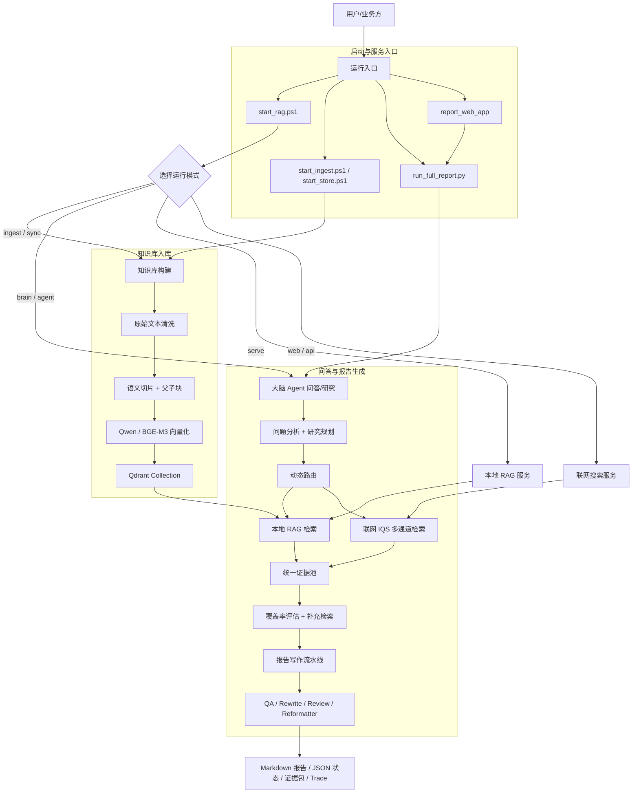
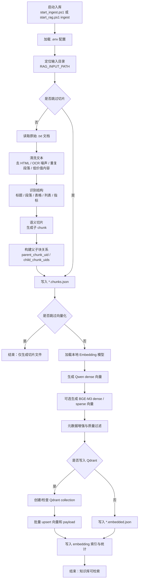
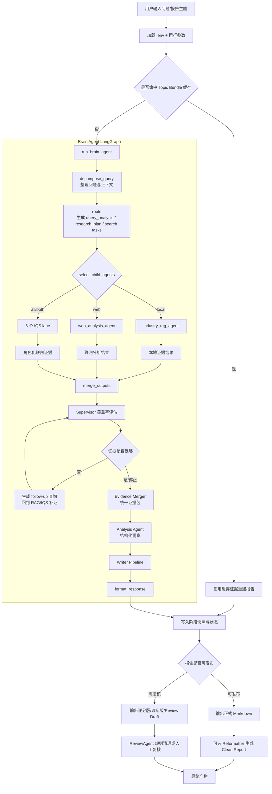
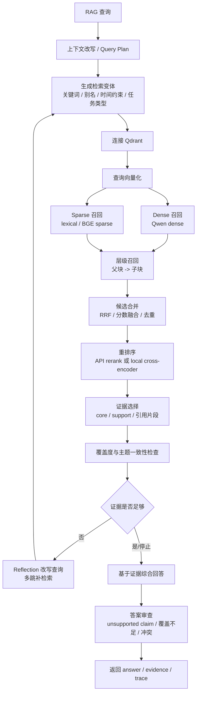
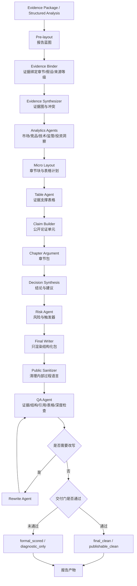
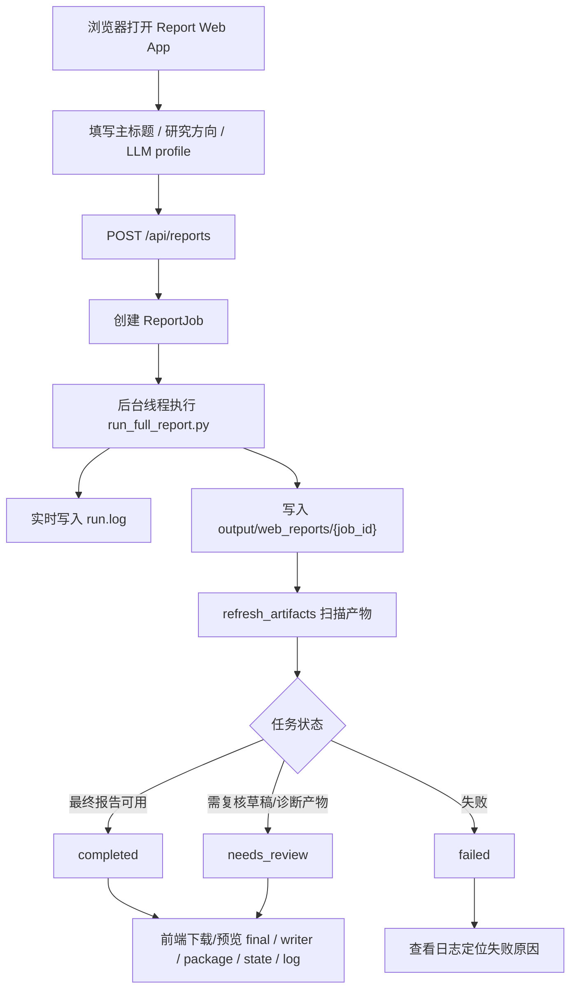
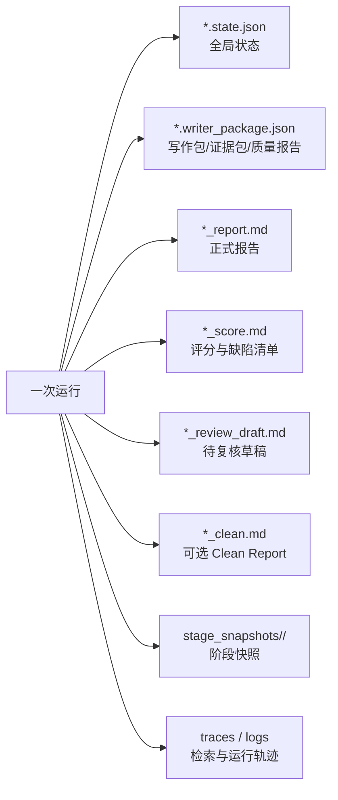

# RAG2 功能流程图

本文档根据当前 `current_rag_pipeline` 项目结构整理，覆盖知识库入库、问答/报告生成、多智能体调度、证据治理、写作质检和 Web 报告入口。

## 1. 功能总览

## 2. 知识库入库流程

对应模块：

| 功能 | 代码位置 |
|---|---|
| 入库编排 | `rag_pipeline/pipelines/ingest_pipeline.py` |
| 文本清洗与切片 | `rag_pipeline/ingest/slicing.py` |
| 向量化与 Qdrant 写入 | `rag_pipeline/ingest/embedding_qdrant.py` |

## 3. 问答/报告主流程

对应模块：

| 功能 | 代码位置 |
|---|---|
| 完整报告入口 | `rag_pipeline/flows/report/full_report.py` |
| 大脑 Agent 主图 | `rag_pipeline/agents/brain_agent.py` |
| 证据合并 | `rag_pipeline/agents/evidence_merger.py` |
| 写作流水线 | `rag_pipeline/agents/writer_agent_clean.py` |
| 重排版与审查 | `rag_pipeline/flows/report/reformatter_agent.py`、`review_pipeline.py` |

## 4. 本地 RAG 检索子流程

对应模块：

| 功能 | 代码位置 |
|---|---|
| 检索入口 | `rag_pipeline/search/engine.py` |
| 上下文构造 | `rag_pipeline/search/context_builder.py` |
| 多跳反思 | `rag_pipeline/search/reflection.py` |
| 答案综合 | `rag_pipeline/search/synthesis.py` |
| 答案审查 | `rag_pipeline/search/review.py` |
| Trace | `rag_pipeline/search/trace.py` |

## 5. 写作生产与质量治理流程

关键原则：

- Writer 不直接新增事实，只渲染上游结构化包。
- 证据覆盖不足时，系统优先补证、降级表达或输出诊断/评分版。
- QA 和 Reformatter 主要处理公开表达、引用规范、格式和发布可用性。

## 6. Web 报告应用流程

对应模块：

| 功能 | 代码位置 |
|---|---|
| Web API | `report_web_app/main.py` |
| 前端页面 | `report_web_app/static/index.html`、`app.js`、`styles.css` |

## 7. 主要产物

## 8. 一句话版本

这个项目的核心功能链路是：

> 原始资料入库到 Qdrant 知识库，用户问题进入 Brain Agent 后被拆成研究计划和搜索任务，本地 RAG 与联网 IQS 并行补齐证据，Evidence Merger 和 Supervisor 做覆盖率闭环，Writer Pipeline 只基于结构化证据生成报告，最后由 QA、Review 和 Reformatter 输出可发布或待复核的 Markdown 产物。
