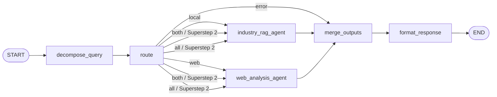

# LangGraph 大脑 Agent

本项目现在用 `brain_agent` 作为行业研究多智能体系统的主 Agent / Supervisor。它负责理解问题、选择子智能体、收集证据输出，并把结果汇总为供下游 Analysis Agent 使用的结构化决策包。

## Agent 模块

- 模块：`rag_pipeline.agents.brain_agent`
- Agent 名称：`brain_agent`
- 主图工厂：`create_brain_agent_graph()`
- 程序入口：`run_brain_agent(query, route="auto", ...)`
- 工具入口：`create_brain_agent_tool()`

## 图结构



当 `route=both` 时，`industry_rag_agent` 和 `web_analysis_agent` 会在同一个 LangGraph superstep 中同时触发；两个分支都完成后，才进入 `merge_outputs`。`merge_outputs` 内部会运行 Supervisor 三段式闭环：评估证据覆盖率、决定是否补证、把补充问题下发给 RAG/IQS 并行执行。

## 子智能体职责

- `industry_rag_agent`：基于本地 Qdrant 知识库做行研 RAG，输出带本地证据引用的回答。
- `web_analysis_agent`：基于阿里云 IQS Skills 做联网检索、网页读取、行情/财务/融资估值等公开信息分析，输出带来源编号的结构化结论。
- `brain_agent`：作为 Supervisor 判断调用路径，规整两个子智能体输出，保留 `[RAG]`、`[WEB]` 证据边界，必要时调用大模型生成最终决策包。

## 路由策略

- `route=local`：只调用本地 RAG 子智能体。
- `route=web`：只调用联网分析子智能体。
- `route=both`：并行调用本地 RAG 和联网分析，两个结果都返回后进入汇总节点。
- `route=all`：并行调用本地 RAG 和联网分析两个子智能体。
- `route=auto`：按问题意图自动判断。含“最新、现在、行情、政策、新闻、股价”等实时意图时会优先联网；企业发展、个人发展、职业成长、赚钱致富、金融投资、融资并购等开放问题默认走双子智能体并行协作。

## CLI

默认问答入口会走大脑 Agent：

```powershell
.\start_rag.ps1 --query 现在机器人行情怎么样
```

显式运行大脑 Agent：

```powershell
.\start_rag.ps1 brain --route auto --query 现在机器人行情怎么样
.\start_rag.ps1 brain --route both --query 结合本地资料和最新网页，分析机器人行业行情
.\start_rag.ps1 brain --route local --query 可可资本有哪些投资项目
.\start_rag.ps1 brain --route web --query 机器人行业最新融资新闻
.\start_rag.ps1 brain --route all --query 结合机器人行业和NVDA股价分析机会
```

查看完整状态：

```powershell
.\start_rag.ps1 brain --json --query 现在机器人行情怎么样
```

## 程序化调用

```python
from rag_pipeline.agents.brain_agent import create_brain_agent_graph, run_brain_agent

graph = create_brain_agent_graph()
state = graph.invoke({"query": "现在机器人行情怎么样", "route": "auto"})
print(state["answer_text"])

state = run_brain_agent("结合本地资料和最新网页，分析机器人行业行情", route="both")
print(state["raw_output"]["supervisor_decision"])
```

## 输出字段

- `answer_text`：默认是精简报告数据包 JSON，字段包括 `conclusion`、`financial_data`、`key_data`、`data_gaps`、`next_action`。如需完整 Supervisor 调试包，使用 `--output-mode supervisor_json`。
- `raw_output.route`：实际路由，值为 `local`、`web` 或 `both`。
- `raw_output.route_reason`：路由原因。
- `raw_output.graph_trace`：LangGraph 主 Agent 和子 Agent 的调度轨迹。
- `raw_output.child_outputs`：已标准化后的两个子 Agent 输出，结构为 `{answer, confidence, key_sources, limitations, status}`。
- `raw_output.evidence_pool`：多轮证据池，包含初始问题和补充问题拿到的 RAG/IQS 证据。
- `raw_output.evidence_pool_summary`：按 5 个行研维度压缩后的证据摘要。
- `raw_output.coverage_evaluation`：最新一轮覆盖率评估结果。
- `raw_output.loop_trace`：每轮覆盖率、缺口、补充问题和补充结果。
- `raw_output.supervisor_decision`：最终 Supervisor 决策包对象。
- `raw_output.local_state` / `raw_output.web_state`：仅在 `--include-raw-child-states` 或 `BRAIN_PARALLEL_RAW_OUTPUT=1` 时附带，用于调试原始子状态。
- `raw_output.merge`：大脑汇总方式，`source=supervisor_llm` 表示大模型按 Supervisor 提示词融合，`source=supervisor_fallback` 表示规则兜底生成，`source=supervisor_fallback_after_llm_error` 表示大模型失败后降级。
- `errors`：子智能体或汇总阶段的异常。若仍有可用子结果，最终回答会保留，并把异常作为证据缺口输出。

默认 `answer_text` 的 JSON 结构：

```json
{
  "conclusion": "一句话核心判断",
  "confidence": 0.0,
  "coverage_score": 0.8,
  "financial_data": [],
  "key_data": [],
  "qualitative_evidence": [],
  "data_gaps": [],
  "next_action": "complete"
}
```

## 环境变量

统一写在项目根目录 `.env`：

```env
BRAIN_AGENT_ROUTE=auto
BRAIN_ENABLE_LLM_MERGE=1
BRAIN_WEB_ENABLE_LLM_ANALYSIS=1
BRAIN_PARALLEL_RAW_OUTPUT=0
BRAIN_ENABLE_FOLLOWUP_LOOP=1
BRAIN_ENABLE_LLM_COVERAGE_EVAL=1
BRAIN_SUPERVISOR_MAX_LOOPS=3
BRAIN_SUPERVISOR_MIN_COVERAGE_GAIN=0.10
BRAIN_SUPERVISOR_MAX_FOLLOWUP_QUERIES=4
BRAIN_FOLLOWUP_PARALLEL_WORKERS=4
BRAIN_OUTPUT_MODE=writer_markdown
ALIYUN_IQS_API_KEY=your-iqs-api-key
```

当前建议保持 `BRAIN_PARALLEL_RAW_OUTPUT=0`，让默认输出保持干净的最终 Markdown 报告。调试时可临时加 `--include-raw-child-states`，把两个子 Agent 的原始状态放进 `raw_output`。

补证闭环的三道停机门：

- 最多 `BRAIN_SUPERVISOR_MAX_LOOPS` 轮，默认 3。
- 每轮覆盖率提升小于等于 `BRAIN_SUPERVISOR_MIN_COVERAGE_GAIN` 时停止。
- 覆盖率达到 0.8 或只剩 minor 缺口时直接放行进入后续 Analysis Agent。
