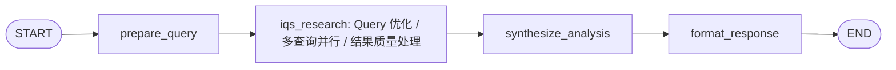

# LangGraph 联网分析子智能体

本模块把阿里云 IQS Skills 封装成 LangGraph 联网分析子智能体，供 `brain_agent` 在需要最新公开信息、网页读取、政策新闻和事实核验时调用。

## Agent 模块

- `rag_pipeline.agents.web_analysis_agent`
- Agent name: `web_analysis_agent`
- Main graph factory: `create_web_analysis_agent_graph()`
- Programmatic runner: `run_web_analysis_agent(query, search_options={...})`
- Supervisor/tool entrypoint: `create_web_analysis_tool()`

## Environment

所有项目级环境变量统一写入项目根目录 `.env`。联网分析必填：

```env
ALIYUN_IQS_API_KEY=your-iqs-api-key
```

可选：

```env
ALIYUN_IQS_SKILL_DIR=D:\pychram\RAG2\.agents\skills\alibabacloud-iqs-search
IQS_SEARCH_ENGINE_TYPE=auto
IQS_SEARCH_TIME_RANGE=NoLimit
IQS_SEARCH_CONTENTS=summary
IQS_SEARCH_CATEGORY=
IQS_SEARCH_NUM_RESULTS=100
IQS_SEARCH_TIMEOUT_MS=20000
```

Agent 会自动在常见工作区位置查找 `alibabacloud-iqs-search`，通常不需要配置 `ALIYUN_IQS_SKILL_DIR`。如果需要固定路径，也统一写入 `.env`。

## 图结构



### 节点

- `prepare_query`：提取用户问题和 URL，推断 IQS 搜索参数。
- `iqs_research`：先做 Query 重写/多视角拆解，再并行调用阿里云 IQS Skill 的 `scripts/search.mjs` 和 `scripts/readpage.mjs`，最后做可信源评分、去重和 rerank 精排。
- `synthesize_analysis`：在可用时使用项目配置的大模型做结构化分析，否则返回抽取式网页摘要。
- `format_response`：追加 assistant 消息，并返回适合 Supervisor 消费的状态。

## 联网搜索优化链路

当前联网搜索不是直接把用户原句丢给 IQS，而是按三层处理：

- Query 优化：默认生成最多 5 个行研子查询，覆盖数据、政策、竞争格局、资本市场等视角；可选开启 `IQS_ENABLE_LLM_QUERY_REWRITE=1` 使用大模型改写，也可开启 `IQS_ENABLE_HYDE=1` 增加 HyDE 语义扩展查询。
- 搜索执行：每个子查询会按意图选择一个或多个 IQS engine/resource 并行搜索，单个搜索任务默认返回 100 条；主搜索结果不足时自动切换 fallback engine 降级重试。
- 质量处理：先按 URL/内容去重，再按来源可信度打分，最后复用项目 `.env` 中的 `RAG_RERANK_*` 配置调用当前 rerank 模型，默认保留 20 条高质量来源。

相关 `.env` 配置：

```env
IQS_ENABLE_QUERY_OPTIMIZATION=1
IQS_ENABLE_LLM_QUERY_REWRITE=0
IQS_ENABLE_HYDE=0
IQS_MAX_QUERIES=6
IQS_INITIAL_MAX_QUERIES=1
IQS_FOLLOWUP_MAX_QUERIES=1
IQS_MAX_SEARCH_TASKS=10
IQS_INITIAL_MAX_SEARCH_TASKS=2
IQS_FOLLOWUP_MAX_SEARCH_TASKS=2
IQS_RESULTS_PER_QUERY=100
IQS_INITIAL_RESULTS_PER_QUERY=50
IQS_FOLLOWUP_RESULTS_PER_QUERY=100
IQS_FALLBACK_MODE=empty_only
IQS_ENABLE_BATCH_SEARCH=1
IQS_BATCH_CONCURRENCY=4
IQS_ENGINE_ROUTE_DATA=LiteAdvanced,Generic
IQS_ENGINE_ROUTE_NEWS=Generic,LiteAdvanced
IQS_ENGINE_ROUTE_POLICY=LiteAdvanced,Generic
IQS_ENGINE_ROUTE_ANALYSIS=LiteAdvanced,Generic
IQS_ENGINE_ROUTE_FINANCE=LiteAdvanced,Generic
IQS_FALLBACK_ENGINE_TYPES=Generic,LiteAdvanced
IQS_RERANK_TOP_K=20
IQS_INITIAL_RERANK_TOP_K=10
IQS_FOLLOWUP_RERANK_TOP_K=20
IQS_RERANK_MAX_DOCS=100
IQS_INITIAL_RERANK_MAX_DOCS=50
IQS_FOLLOWUP_RERANK_MAX_DOCS=100
IQS_RERANK_PREFILTER_MAX_DOCS=50
IQS_DEDUP_THRESHOLD=0.88
RAG_ENABLE_API_RERANK=1
RAG_RERANK_MODEL=qwen3-rerank
```

## CLI

Use through the project launcher:

```powershell
.\start_rag.ps1 web --query 机器人行业最新行情
```

强制近期新闻类搜索：

```powershell
.\start_rag.ps1 web --query 机器人行业最新政策 --engine-type Generic --time-range OneWeek
```

读取指定 URL：

```powershell
.\start_rag.ps1 web --url https://example.com/article --query 分析这篇文章的行业影响
```

直接运行模块：

```powershell
..\.venv\Scripts\python.exe -m rag_pipeline.agents.web_analysis_agent --query 机器人行业最新行情
```

调试完整状态：

```powershell
.\start_rag.ps1 web --json --query 机器人行业最新行情
```

## 多智能体用法

直接使用编译后的子图：

```python
from rag_pipeline.agents.web_analysis_agent import create_web_analysis_agent_graph

web_agent = create_web_analysis_agent_graph()
state = web_agent.invoke({"query": "机器人行业最新行情"})
print(state["answer_text"])
```

或暴露为工具，让更上层 Supervisor 调用：

```python
from rag_pipeline.agents.web_analysis_agent import create_web_analysis_tool

web_tool = create_web_analysis_tool()
```

推荐路由：

- 本地私有知识库问题使用 `industry_rag_agent`。
- 最新事件、新闻、政策、公开网页、价格行情和事实核验使用 `web_analysis_agent`。
- 同时需要本地资料和外部最新信息时使用 `brain_agent` 的 `route=both`。
